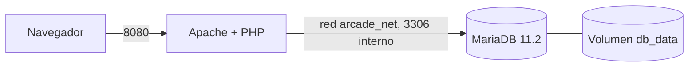

# 🕹️ Salón recreativo · Práctica final RA1

Web con el ranking de récords de un arcade, desplegada con **Apache + PHP + MariaDB en contenedores Docker**.

**Alumno/a:** _COMPLETAR_ · **Módulo:** Implantación de Aplicaciones Web (0376) · ASIR 2º
**Repositorio:** https://github.com/adripasalbe/salon-de-jueguitos

> Los apartados marcados como `COMPLETAR` se rellenan con la salida real de tu equipo antes de entregar.

---

## 1. Descripción del stack

| Capa | Tecnología | Dónde se ejecuta |
|---|---|---|
| Servidor web | Apache 2 (imagen `php:8.3-apache`) | Servidor (contenedor `web`) |
| Intérprete | PHP 8.3 + extensión `mysqli` | Servidor (contenedor `web`) |
| SGBD | MariaDB 11.2 | Servidor (contenedor `db`) |
| Interfaz | HTML + CSS + JavaScript | **Cliente** (navegador) |
| Orquestación | Docker Compose | Máquina anfitriona |

- **Servidor:** PHP se conecta a MariaDB, consulta `ranking`, genera el HTML y calcula la hora del servidor.
- **Cliente:** el navegador pinta HTML/CSS y ejecuta el JavaScript (hora del navegador, reloj de `arcade.html`).

## 2. Arquitectura



Solo el puerto **8080** se publica en el host. MariaDB solo es accesible desde la red interna `arcade_net`.

## 3. Estructura del proyecto

```
salon-de-jueguitos/
├── docker-compose.yml
├── Dockerfile
├── .env                # NO se sube (en .gitignore)
├── .env.example        # plantilla sin secretos
├── .gitignore
├── init/init.sql       # datos iniciales (no modificado)
├── src/index.php       # aplicación (no modificada)
├── src/arcade.html     # portada retro (extra)
└── README.md
```

## 4. Ficheros clave

### `docker-compose.yml`

```yaml
services:
  db:
    image: mariadb:11.2            # versión concreta, no latest
    env_file: .env
    volumes:
      - db_data:/var/lib/mysql     # volumen con nombre: persistencia
      - ./init/init.sql:/docker-entrypoint-initdb.d/init.sql:ro
    healthcheck:
      test: ["CMD", "healthcheck.sh", "--connect", "--innodb_initialized"]
      interval: 5s
      retries: 10
    networks:
      - arcade_net

  web:
    build: .
    ports:
      - "8080:80"
    environment:                   # solo lo que necesita la app
      DB_HOST: db
      DB_NAME: ${MARIADB_DATABASE}
      DB_USER: ${MARIADB_USER}
      DB_PASS: ${MARIADB_PASSWORD}
    depends_on:
      db:
        condition: service_healthy
    networks:
      - arcade_net

volumes:
  db_data:

networks:
  arcade_net:
    driver: bridge
```

### `Dockerfile`

```dockerfile
FROM php:8.3-apache

RUN docker-php-ext-install mysqli

RUN echo "ServerTokens ProductOnly" >> /etc/apache2/apache2.conf \
    && echo "ServerSignature Off" >> /etc/apache2/apache2.conf

RUN RUN_PHP_INI="$PHP_INI_DIR/php.ini-production" \
    && cp "$RUN_PHP_INI" "$PHP_INI_DIR/php.ini" \
    && sed -i 's/expose_php = On/expose_php = Off/' "$PHP_INI_DIR/php.ini"

COPY src/ /var/www/html/
```

- `mysqli`: la imagen oficial no la trae y `index.php` la necesita.
- `ServerTokens ProductOnly` / `ServerSignature Off`: Apache solo dice `Apache`, sin versión ni SO.
- `php.ini-production` + `expose_php = Off`: PHP no envía la cabecera `X-Powered-By`.
- `COPY src/`: el código queda dentro de la imagen (reproducible y versionado).

### `.env.example`

```
MARIADB_ROOT_PASSWORD=cambia_esto
MARIADB_DATABASE=arcade
MARIADB_USER=jugador
MARIADB_PASSWORD=cambia_esto_tambien
```

## 5. Comandos de despliegue

**Local**

```bash
git clone https://github.com/adripasalbe/salon-de-jueguitos.git
cd salon-de-jueguitos
cp .env.example .env          # editar con dos contraseñas distintas
docker compose up -d --build
docker compose ps             # db debe aparecer "healthy"
# http://localhost:8080   ·   portada retro: http://localhost:8080/arcade.html
```

**Play with Docker**

```bash
git clone https://github.com/adripasalbe/salon-de-jueguitos.git
cd salon-de-jueguitos
cp .env.example .env && nano .env
docker compose up -d --build
# pulsar el badge "8080" para abrir la web
```

**Parar / limpiar**

```bash
docker compose down        # borra contenedores, conserva datos
docker compose down -v     # además borra el volumen (pierde datos)
```

## 6. Nivel 1 · Base de datos

### ¿Por qué no pasamos la contraseña de root al servicio `web`?

Por el **principio de mínimo privilegio**. La aplicación solo necesita `DB_HOST`, `DB_NAME`, `DB_USER` y `DB_PASS`. Si `web` recibiera `MARIADB_ROOT_PASSWORD` (con `env_file: .env`) y alguien explotase un fallo de PHP, podría leerla (`getenv`, `phpinfo()`…) y controlar todo el servidor de base de datos. Pasando solo lo imprescindible se limita el daño.

### `SHOW GRANTS`

```
COMPLETAR: pega aquí la salida (sustituye el hash de la contraseña por <hash>)
```

- **¿Sobre qué base de datos tiene permisos `jugador`?** Solo sobre `arcade` (la indicada en `MARIADB_DATABASE`).
- **¿Por qué no usamos root desde la aplicación?** Root puede crear/borrar bases y usuarios y leer cualquier dato. Con `jugador`, una inyección SQL o un fallo de la app queda limitado a la base `arcade`.

### Persistencia

| Acción | Resultado | Motivo |
|---|---|---|
| `docker compose down` + `up -d` | Los datos **siguen ahí** | Se elimina el contenedor, pero el **volumen** `db_data` persiste y se vuelve a montar en `/var/lib/mysql`. |
| `docker compose down -v` + `up -d` | Los datos **se reinician** | `-v` borra también el volumen; al arrancar vacío, MariaDB ejecuta de nuevo `init.sql`. |

### 🪙 Moneda 1

Obtenida con el cliente SQL (`SELECT * FROM ranking;`), en la fila cuyo `jugador` empieza por `MONEDA`:

```
MONEDA-1: ARC-7X3K
```

## 7. Nivel 2 · PHP y cliente/servidor

### ¿Qué se ejecuta en el servidor y qué en el cliente?

- **Servidor (PHP en Apache):** conexión con MariaDB vía `mysqli`, consulta del ranking, generación del HTML y **hora del servidor** (`date()`).
- **Cliente (navegador):** renderizar HTML/CSS y ejecutar el **JavaScript**, que obtiene la **hora del navegador** (`new Date()`).

### ¿Por qué las dos horas pueden no coincidir?

1. Vienen de relojes de máquinas distintas (contenedor y equipo del usuario), que pueden estar desajustados.
2. Pueden tener **zonas horarias diferentes**: el contenedor suele ir en UTC y el navegador usa la zona local (p. ej. Europe/Madrid).
3. La hora PHP se fija al generar la página y queda congelada; la de JS se calcula al cargar, con el retardo de red entre medias.

### 🪙 Moneda 2

Aparece en la web (http://localhost:8080) cuando la conexión funciona:

```
MONEDA 2: ARC-Q9M2
```

## 8. Nivel 3 · Seguridad

### 8.1 Sin credenciales en el repositorio

```bash
git ls-files
git log -p | grep -F "<mi contraseña>"
```

```
COMPLETAR: debe listar .env.example y NO .env (ni .env.save); el grep no debe devolver nada
```

### 8.2 Puerto 3306 no publicado

```bash
docker compose ps
```

```
COMPLETAR: db sin "0.0.0.0:3306->3306"; solo web con 0.0.0.0:8080->80
```

### 8.3 La aplicación usa `jugador`, no `root`

```bash
docker compose exec web env | grep -E "DB_|MARIADB"
```

```
COMPLETAR: debe verse DB_USER=jugador y NO aparecer MARIADB_ROOT_PASSWORD
```

### 8.4 Apache y PHP no revelan su versión

```bash
curl -I http://localhost:8080
```

```
COMPLETAR: "Server: Apache" sin número de versión y sin cabecera X-Powered-By
```

### 🪙 Moneda 3

```
COMPLETAR: me la da la profesora al comprobar curl -I y docker compose ps
```

## 9. Las 3 monedas

| # | Dónde | Código |
|---|---|---|
| 1 | Tabla `ranking` (cliente SQL) | `ARC-7X3K` |
| 2 | Web con la conexión funcionando | `ARC-Q9M2` |
| 3 | Comprobación en directo | `COMPLETAR` |

## 10. Problemas que me encontré y cómo los resolví

1. **Subí por error un fichero de variables al repo (`.env.save`).** En el primer commit entró `.env.save`, una copia del `.env` que no cubría el `.gitignore`. Contenía solo valores de plantilla (sin contraseñas reales), y lo comprobé con `git log -p | grep -F` buscando mis contraseñas actuales: sin resultados. Aun así, borrarlo de un commit posterior no lo elimina del historial, así que amplié `.gitignore` (`.env.*`, `*.save`, con excepción de `.env.example`) y añadí un `.env.example` como plantilla.
2. **Error de `mysqli`.** La imagen `php:8.3-apache` no incluye la extensión. Creé un `Dockerfile` con `docker-php-ext-install mysqli` y cambié `web` a `build: .`.
3. **El `init.sql` no se aplicaba tras cambiarlo.** Solo se ejecuta con el volumen vacío; hay que hacer `docker compose down -v` y volver a levantar.
4. **El `Dockerfile` se llamaba `dockerfile` y el bind mount `./src:/var/www/html` anulaba el `COPY`.** Lo renombré a `Dockerfile` y quité el bind mount para que la imagen contenga el código y sea reproducible.
